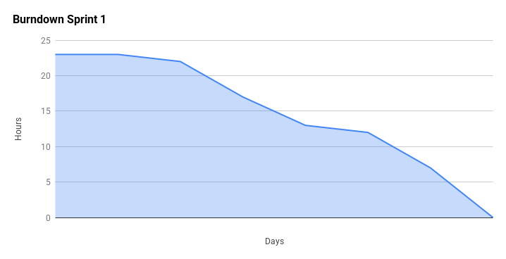
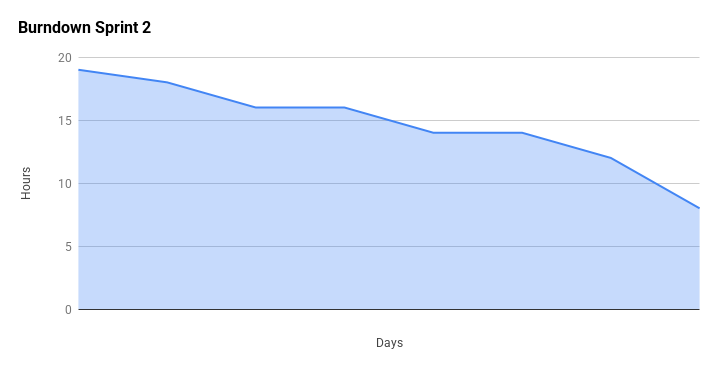
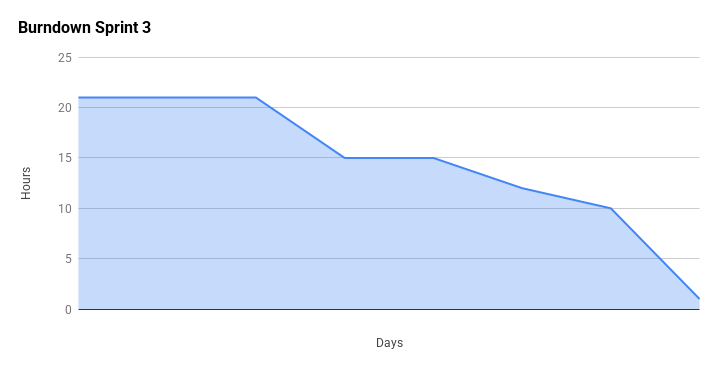

[](https://codecov.io/gh/m0ssse/ohtuprojekti)


## Backlog

Linkki [Backlogiin](https://docs.google.com/spreadsheets/d/1ydUu7JQKO1yzsdHjvVuIUvUM6oZylWIb34DH69oyu7k/edit?gid=0#gid=0).

#### Defenition of Done
Userstory on valmis kun sen vaatimukset täytetään omalla branchillä, joku muu henkilö hyväksyy muutokset ja branch mergetään deviin. Lisäksi testejen pitää onnistua.

## How to use
1. Clone the project ```https://github.com/m0ssse/ohtuprojekti.git```
2. In the project folder (ohtuprojekti/), install dependancies ```poetry install```
3. Enter virtual environment ```eval $(poetry env activate)```
4. Create and setup database ```python src/db_helper.py```
5. Start flask and host webapp locally ```python src/index.py```
6. Run robot tests while hosting webapp ```robot src/story_tests``` or ```robot --variable BROWSER:firefox src/story_tests``` depending on browser
7. Run pylint ```PYTHONPATH=src poetry run pylint src```
8. Run unit tests ```PYTHONPATH=src poetry run pytest src/tests```


### Sprint 1



### Sprint 2



### Sprint 3
